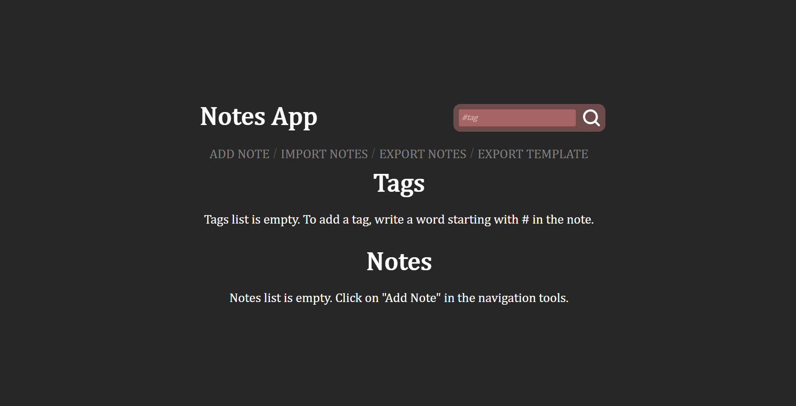

# Training project: Note Editor

## Netlify DEMO

https://yds-notes-app.netlify.app

## Description

Develop a single page application in React: a text editor for notes with tags.
Actions:
1. Create, edit, view and delete notes;
2. Filter notes by tag;
3. Adding and removing tags from the list;
4. Store data in json format;
5. Using the CSS preprocessor;
6. Using TypeScript;
7. Upload to Git;
8. Upload to Netlify.

Notes:
While editing a note, the user can create tags using the # symbol.
For example: the user enters the text “I wanna go to #shop”. As you (end) the input, the corresponding tag should be created and displayed in the list below the text field.
When editing a note, all words that match the tags should be highlighted.

## Installation

Install the needed dependencies:

    npm install

Open the terminal in the project folder and run the application in developer mode:

    npm start

## Building

Creates a build directory with a production build of your app. The build is minified and the filenames include the hashes.

Open the terminal in the project folder and builds the app for production to the build folder:

    npm run build
